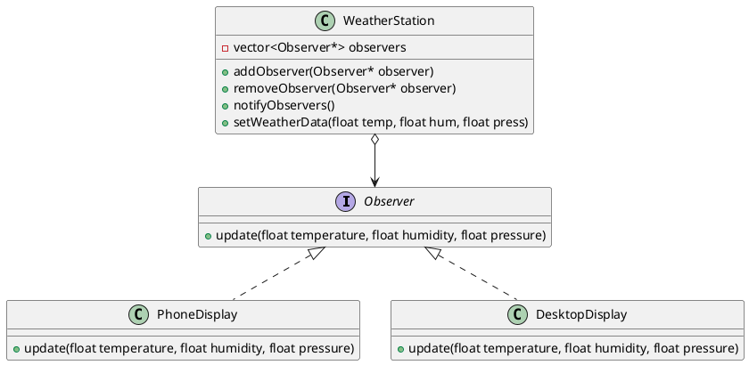

# Observer Design Pattern

### The Observer Pattern defines a one-to-many dependency between objects so that when one object (the subject) changes state, all its dependents (observers) are notified and updated automatically. This pattern is commonly used in event-driven systems.

In this example, we implement a weather monitoring system where multiple displays (observers) are updated whenever the weather data changes in the `WeatherStation` (subject).

---

## Code Implementation

### Full Implementation in C++

```cpp
#include <iostream>
#include <vector>
#include <string>
#include <algorithm> 
using namespace std;

class Observer {
public:
    virtual void update(float temperature, float humidity, float pressure) = 0;
};

class WeatherStation {
private:
    vector<Observer*> observers;  
    float temperature;
    float humidity;
    float pressure;

public:

    void addObserver(Observer* observer) {
        observers.push_back(observer);
    }

    void removeObserver(Observer* observer) {
        observers.erase(remove(observers.begin(), observers.end(), observer), observers.end());
    }

    void notifyObservers() {
        for (Observer* observer : observers) {
            observer->update(temperature, humidity, pressure);
        }
    }

    void setWeatherData(float temp, float hum, float press) {
        temperature = temp;
        humidity = hum;
        pressure = press;
        notifyObservers();
    }
};

class PhoneDisplay : public Observer {
public:
    void update(float temperature, float humidity, float pressure) override {
        cout << "Phone Display: Weather Update!" << endl;
        cout << "Temperature: " << temperature << "°C, Humidity: " << humidity << "%, Pressure: " << pressure << " hPa" << endl;
    }
};

class DesktopDisplay : public Observer {
public:
    void update(float temperature, float humidity, float pressure) override {
        cout << "Desktop Display: Weather Update!" << endl;
        cout << "Temperature: " << temperature << "°C, Humidity: " << humidity << "%, Pressure: " << pressure << " hPa" << endl;
    }
};

int main() {
    
    WeatherStation weatherStation;

    PhoneDisplay phoneDisplay;
    DesktopDisplay desktopDisplay;

    weatherStation.addObserver(&phoneDisplay);
    weatherStation.addObserver(&desktopDisplay);

    weatherStation.setWeatherData(22.5, 65.0, 1013.2);
    weatherStation.setWeatherData(23.0, 60.0, 1012.8);

    weatherStation.removeObserver(&desktopDisplay);

    weatherStation.setWeatherData(24.5, 55.0, 1010.0);

}
```

---

## Explanation

### Key Components

1. **Subject (WeatherStation)**:
   - Maintains a list of observers.
   - Notifies all observers when its state changes.

2. **Observer Interface**:
   - Declares an `update` method that all concrete observers must implement.

3. **Concrete Observers (PhoneDisplay, DesktopDisplay)**:
   - Implement the `update` method to react to changes in the subject.

4. **Dynamic Behavior**:
   - Observers can be added or removed dynamically at runtime.

---

## UML Diagram



---

## Advantages

1. **Loose Coupling**: The subject and observers are loosely coupled. The subject doesn't need to know the details of the observers.
2. **Dynamic Relationships**: Observers can be added or removed at runtime.
3. **Scalability**: Multiple observers can listen to changes in the subject.

## Disadvantages

1. **Potential Performance Issues**: Notifying a large number of observers can be resource-intensive.
2. **Dependency Management**: Managing the lifecycle of observers can be complex if they need to be removed dynamically.

---

## When to Use

- When changes to one object should trigger updates to others.
- In event-driven systems where multiple components need to react to changes in a single subject.
- For decoupling the subject from its dependents.

