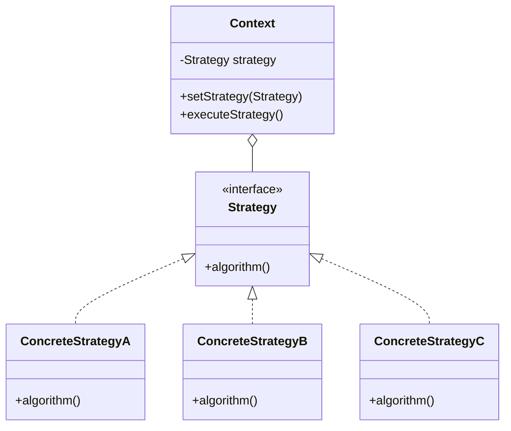

# Strategy Design Pattern

### The Strategy Design Pattern defines a family of algorithms, encapsulates each one, and makes them interchangeable. It allows the algorithm to vary independently from the clients that use it. In this implementation, we demonstrate a `TreeStructure` system where the tree type strategy (e.g., Binary Search Tree or Simple Binary Tree) can be dynamically set at runtime.

---

## Code Implementation

### Full Implementation in C++

```cpp
#include <iostream>

class TreeNode {
public:
    int value;
    TreeNode* left;
    TreeNode* right;

    TreeNode(int val) : value(val), left(nullptr), right(nullptr) {}
};

class Tree {
public:
    virtual void insert(int value) = 0;
    virtual void traverse() const = 0;
    virtual ~Tree() = default;
};

class BinarySearchTree : public Tree {
private:
    TreeNode* root;

    void insertHelper(TreeNode*& node, int value) {
        if (!node) {
            node = new TreeNode(value);
        } else if (value < node->value) {
            insertHelper(node->left, value);
        } else {
            insertHelper(node->right, value);
        }
    }

    void traverseHelper(TreeNode* node) const {
        if (node) {
            traverseHelper(node->left);
            std::cout << node->value << " ";
            traverseHelper(node->right);
        }
    }

    void deleteTree(TreeNode* node) {
        if (node) {
            deleteTree(node->left);
            deleteTree(node->right);
            delete node;
        }
    }

public:
    BinarySearchTree() : root(nullptr) {}

    ~BinarySearchTree() {
        deleteTree(root);
    }

    void insert(int value) override {
        insertHelper(root, value);
    }

    void traverse() const override {
        traverseHelper(root);
        std::cout << std::endl;
    }
};

class SimpleBinaryTree : public Tree {
private:
    TreeNode* root;

    void insertHelper(TreeNode*& node, int value) {
        if (!node) {
            node = new TreeNode(value);
        } else {
            if (value < node->value) {
                insertHelper(node->left, value);
            } else {
                insertHelper(node->right, value);
            }
        }
    }

    void traverseHelper(TreeNode* node) const {
        if (node) {
            traverseHelper(node->left);
            std::cout << node->value << " ";
            traverseHelper(node->right);
        }
    }

    void deleteTree(TreeNode* node) {
        if (node) {
            deleteTree(node->left);
            deleteTree(node->right);
            delete node;
        }
    }

public:
    SimpleBinaryTree() : root(nullptr) {}

    ~SimpleBinaryTree() {
        deleteTree(root);
    }

    void insert(int value) override {
        insertHelper(root, value);
    }

    void traverse() const override {
        traverseHelper(root);
        std::cout << std::endl;
    }
};

class TreeStructure {
private:
    Tree* tree;

public:
    TreeStructure() : tree(nullptr) {}

    ~TreeStructure() {
        delete tree;
    }

    void setTree(Tree* t) {
        delete tree; // Clean up the existing tree if any
        tree = t;
    }

    void insert(int value) {
        if (tree) {
            tree->insert(value);
        }
    }

    void traverse() const {
        if (tree) {
            tree->traverse();
        }
    }
};

int main() {
    TreeStructure treeStructure;

    treeStructure.setTree(new BinarySearchTree());
    treeStructure.insert(5);
    treeStructure.insert(3);
    treeStructure.insert(7);
    treeStructure.insert(1);
    treeStructure.insert(4);

    std::cout << "Binary Search Tree Traversal: ";
    treeStructure.traverse();

    treeStructure.setTree(new SimpleBinaryTree());
    treeStructure.insert(10);
    treeStructure.insert(20);
    treeStructure.insert(30);
    treeStructure.insert(40);

    std::cout << "Simple Binary Tree Traversal: ";
    treeStructure.traverse();

    return 0;
}
```

---

## Explanation

### Key Components

1. **Tree Interface**:
   - Defines the common behavior for all tree types (`insert` and `traverse` methods).

2. **Concrete Strategy Classes**:
   - `BinarySearchTree`: Implements the behavior for binary search trees.
   - `SimpleBinaryTree`: Implements the behavior for simple binary trees.

3. **TreeStructure (Context)**:
   - Maintains a reference to a `Tree` object (strategy).
   - Dynamically changes the tree type using `setTree`.

4. **Dynamic Behavior**:
   - By switching the `Tree` implementation, the client (main function) can use different tree structures at runtime.

---



---
## Advantages

1. **Open/Closed Principle**: Easily add new tree types without modifying existing code.
2. **Dynamic Behavior**: Change algorithms (tree types) at runtime.
3. **Encapsulation**: Algorithm details are hidden behind the `Tree` interface.

## Disadvantages

1. **Complexity**: Requires additional classes and interfaces.
2. **Memory Management**: Manually managing `Tree` pointers can lead to memory leaks if not handled carefully.

---

## When to Use

- When multiple algorithms or strategies need to be interchangeable at runtime.
- To adhere to the **Open/Closed Principle**, where the system should be open for extension but closed for modification.
- To encapsulate algorithms and decouple them from the context.
