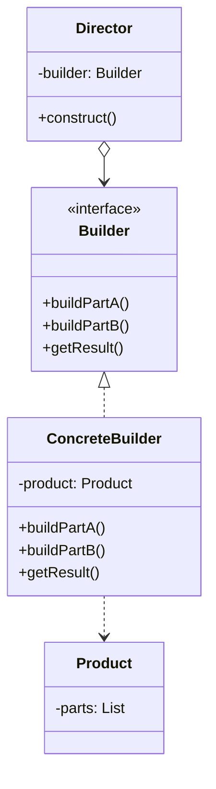

# Builder Design Pattern

### The Builder Pattern is a creational design pattern used to construct complex objects step-by-step. Unlike other creational patterns, the Builder Pattern provides better control over object construction by allowing stepwise assembly of the object’s components.

In this example, a Computer is built using a ComputerBuilder. The ComputerDirector further simplifies creating predefined configurations like gaming or office computers.

---

## Code Implementation

### Full Implementation in C++

```cpp
#include <iostream>
#include <string>
#include <memory>
#include <vector>
using namespace std;

class Computer;

class ComputerBuilder {
public:
    static ComputerBuilder create() {
        return ComputerBuilder();
    }

    ComputerBuilder& setCPU(const string& cpu) {
        m_cpu = cpu;
        return *this;
    }

    ComputerBuilder& setRAM(int ram) {
        m_ram = ram;
        return *this;
    }

    ComputerBuilder& setStorage(int storageSize, const string& type) {
        m_storage = to_string(storageSize);
        m_storageType = type;
        return *this;
    }

    ComputerBuilder& setGPU(const string& gpu) {
        m_gpu = gpu;
        return *this;
    }

    ComputerBuilder& addPeripheral(const string& peripheral) {
        m_peripherals.push_back(peripheral);
        return *this;
    }

    unique_ptr<Computer> build();

private:
    ComputerBuilder() = default;

    string m_cpu;
    int m_ram = 0;
    string m_storage;
    string m_storageType;
    string m_gpu;
    vector<string> m_peripherals;

    friend class Computer;
};

class Computer {
public:
    void showSpecs() const {
        cout << "Computer Specifications:" << endl;
        cout << "CPU: " << cpu << endl;
        cout << "RAM: " << ram << " GB" << endl;
        cout << "Storage: " << storage << " GB " << storageType << endl;
        cout << "GPU: " << (gpu.empty() ? "None" : gpu) << endl;

        cout << "Peripherals:" << endl;
        for (const auto& peripheral : peripherals) {
            cout << "- " << peripheral << endl;
        }
    }

private:
    Computer(const ComputerBuilder& builder)
        : cpu(builder.m_cpu)
        , ram(builder.m_ram)
        , storage(builder.m_storage)
        , storageType(builder.m_storageType)
        , gpu(builder.m_gpu)
        , peripherals(builder.m_peripherals)
    {}

    string cpu;
    int ram = 0;
    string storage;
    string storageType;
    string gpu;
    vector<string> peripherals;

    friend class ComputerBuilder;
};

unique_ptr<Computer> ComputerBuilder::build() {
    if (m_cpu.empty()) {
        throw runtime_error("CPU must be specified");
    }
    if (m_ram == 0) {
        throw runtime_error("RAM must be specified");
    }

    return unique_ptr<Computer>(new Computer(*this));
}

class ComputerDirector {
public:
    static unique_ptr<Computer> buildGamingComputer() {
        return ComputerBuilder::create()
            .setCPU("Intel Core i9")
            .setRAM(32)
            .setStorage(1000, "SSD")
            .setGPU("NVIDIA RTX 4090")
            .addPeripheral("Mechanical Keyboard")
            .addPeripheral("Gaming Mouse")
            .addPeripheral("Gaming Headset")
            .build();
    }

    static unique_ptr<Computer> buildOfficeComputer() {
        return ComputerBuilder::create()
            .setCPU("Intel Core i5")
            .setRAM(16)
            .setStorage(512, "SSD")
            .addPeripheral("Ergonomic Keyboard")
            .addPeripheral("Wireless Mouse")
            .build();
    }
};

int main() {
    cout << "Custom Computer:" << endl;
    auto customComputer = ComputerBuilder::create()
        .setCPU("AMD Ryzen 7")
        .setRAM(16)
        .setStorage(512, "NVMe SSD")
        .setGPU("AMD Radeon RX 6700")
        .addPeripheral("Wireless Keyboard")
        .addPeripheral("Bluetooth Mouse")
        .build();
    customComputer->showSpecs();

    cout << "\nGaming Computer:" << endl;
    auto gamingComputer = ComputerDirector::buildGamingComputer();
    gamingComputer->showSpecs();

    cout << "\nOffice Computer:" << endl;
    auto officeComputer = ComputerDirector::buildOfficeComputer();
    officeComputer->showSpecs();
}

```

---

## Explanation

### Key Components

1. **Builder (ComputerBuilder)**:
   - Provides methods to set various attributes of a Computer.
   - Returns *this in each method to enable a fluent interface for chaining calls.
   - Ensures valid construction by enforcing constraints in the build method (e.g., CPU and RAM must be specified).

2. **Product (Computer)**:
   - The object being built.
   - Attributes (e.g., cpu, ram, storage, gpu) are set based on the builder.

3. **Director (ComputerDirector)**:
   - Provides predefined methods for building common configurations (e.g., gaming or office computers).


---

## UML Diagram



---

## Advantages

1. **Stepwise Construction**:
   - Complex objects can be built step-by-step.
   - Fluent interface improves readability.

2. **Reusable Builder**:
   - The ComputerBuilder is flexible and reusable for creating various types of computers.
     
3. **Director**:
   - Simplifies the creation of predefined configurations (e.g., gaming or office computers).
     
## Disadvantages

1. **Complexity**:
   - Adds extra classes and methods, which might be overkill for simpler objects.
3. **Validation**:
   - Constraints need to be explicitly enforced in the builder (build method).

---

## When to Use

- When constructing complex objects with many optional parameters.
- When you need to enforce constraints during the object construction process.
- When creating objects with similar steps but different configurations (e.g., gaming vs. office computers).

