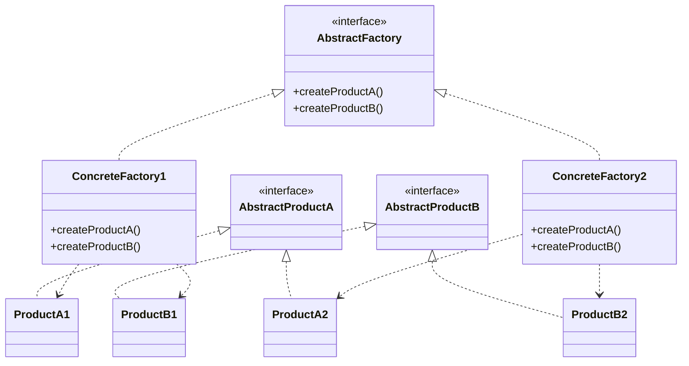

# Abstract Factory Design Pattern

### The Abstract Factory Pattern provides an interface for creating families of related or dependent objects without specifying their concrete classes. This pattern is particularly useful when multiple products share a common theme (e.g., UI components for different operating systems).

In this example, we demonstrate how to create a GUI application with buttons and checkboxes that adapt to the specific operating system (Windows or MacOS) using the Abstract Factory Pattern.

---

## Code Implementation

### Full Implementation in C++

```cpp
#include <iostream>
#include <memory>
using namespace std;

class Button {
public:
    virtual void paint() = 0;
    virtual ~Button() = default;
};

class Checkbox {
public:
    virtual void paint() = 0;
    virtual ~Checkbox() = default;
};

class WindowsButton : public Button {
public:
    void paint() override {
        cout << "Rendering a Windows-style button" << endl;
    }
};

class WindowsCheckbox : public Checkbox {
public:
    void paint() override {
        cout << "Rendering a Windows-style checkbox" << endl;
    }
};

class MacOSButton : public Button {
public:
    void paint() override {
        cout << "Rendering a MacOS-style button" << endl;
    }
};

class MacOSCheckbox : public Checkbox {
public:
    void paint() override {
        cout << "Rendering a MacOS-style checkbox" << endl;
    }
};

class GUIFactory {
public:
    virtual unique_ptr<Button> createButton() = 0;
    virtual unique_ptr<Checkbox> createCheckbox() = 0;
    virtual ~GUIFactory() = default;
};

class WindowsFactory : public GUIFactory {
public:
    unique_ptr<Button> createButton() override {
        return make_unique<WindowsButton>();
    }

    unique_ptr<Checkbox> createCheckbox() override {
        return make_unique<WindowsCheckbox>();
    }
};

class MacOSFactory : public GUIFactory {
public:
    unique_ptr<Button> createButton() override {
        return make_unique<MacOSButton>();
    }

    unique_ptr<Checkbox> createCheckbox() override {
        return make_unique<MacOSCheckbox>();
    }
};

class Application {
private:
    unique_ptr<Button> button;
    unique_ptr<Checkbox> checkbox;

public:
    void createUI(GUIFactory& factory) {
        button = factory.createButton();
        checkbox = factory.createCheckbox();
    }

    void paint() {
        if (button) button->paint();
        if (checkbox) checkbox->paint();
    }
};

unique_ptr<GUIFactory> createOSSpecificFactory(const string& osType) {
    if (osType == "Windows") {
        return make_unique<WindowsFactory>();
    } else if (osType == "MacOS") {
        return make_unique<MacOSFactory>();
    }
    throw runtime_error("Unsupported operating system");
}

```

---

## Explanation

### Key Components

1. **Abstract Product Interfaces (Button, Checkbox)**:
   - Define the interface for individual products (e.g., paint method).

2. **Concrete Products (WindowsButton, MacOSButton, WindowsCheckbox, MacOSCheckbox)**:
   - Implement the product interface for specific themes (Windows or MacOS).

3. **Abstract Factory Interface (GUIFactory):**:
   - Declares factory methods for creating related products (createButton, createCheckbox).

4. **Concrete Factories (WindowsFactory, MacOSFactory)**:
   - Implement the abstract factory interface to create products for specific themes.

5. **Client (Application)**:
   - Uses the abstract factory to create and work with products without being coupled to their concrete classes.
---

## UML Diagram



---

## Advantages

1. **Flexibility**: Easily add new families of products (e.g., Linux-style UI components) without modifying existing code.
2. **Consistency**: Ensures that a family of related products (e.g., Windows-style buttons and checkboxes) is used together.
3. **Encapsulation**: Hides the details of object creation from the client.

## Disadvantages

1. **Complexity**: Adds extra layers of abstraction and classes.
2. **Limited Scalability**: Adding new product types (e.g., sliders) requires changes to all factory interfaces and implementations.

---

## When to Use

- When the system needs to support multiple families of related products.
- To ensure that products from the same family are used together.
- To encapsulate the creation logic for a family of related products.

