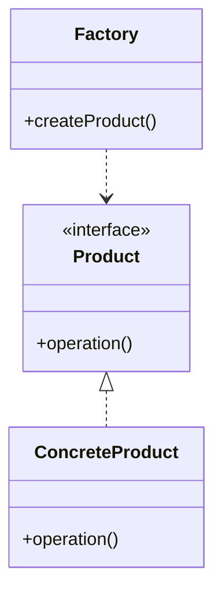

# Factory Method Design Pattern

### The Factory Method Pattern is a creational design pattern that defines an interface for creating objects but allows subclasses to alter the type of objects that will be created. It helps promote loose coupling between the client code and the classes it instantiates.

In this example, we demonstrate how different types of PizzaStore (e.g., CheesePizzaStore, PepperoniPizzaStore) implement the createPizza method to instantiate specific types of Pizza.

---

## Code Implementation

### Full Implementation in C++

```cpp
#include <iostream>
#include <memory>

using namespace std;

class Pizza {
public:
    virtual void prepare() = 0;
    virtual void bake() = 0;
    virtual void cut() = 0;
    virtual void box() = 0;
    virtual ~Pizza() = default;
};

class CheesePizza : public Pizza {
public:
    void prepare() override {
        std::cout << "Preparing Cheese Pizza" << std::endl;
    }
    void bake() override {
        std::cout << "Baking Cheese Pizza" << std::endl;
    }
    void cut() override {
        std::cout << "Cutting Cheese Pizza" << std::endl;
    }
    void box() override {
        std::cout << "Boxing Cheese Pizza" << std::endl;
    }
};

class PepperoniPizza : public Pizza {
public:
    void prepare() override {
       cout << "Preparing Pepperoni Pizza" << endl;
    }
    void bake() override {
        cout << "Baking Pepperoni Pizza" << endl;
    }
    void cut() override {
        cout << "Cutting Pepperoni Pizza" << endl;
    }
    void box() override {
        cout << "Boxing Pepperoni Pizza" << endl;
    }
};

class PizzaStore {
public:
    virtual unique_ptr<Pizza> createPizza() = 0;

    unique_ptr<Pizza> orderPizza() {
        unique_ptr<Pizza> pizza = createPizza();
        
        pizza->prepare();
        pizza->bake();
        pizza->cut();
        pizza->box();
        
        return pizza;
    }

    virtual ~PizzaStore() = default;
};

class CheesePizzaStore : public PizzaStore {
public:
    unique_ptr<Pizza> createPizza() override {
        return make_unique<CheesePizza>();
    }
};

class PepperoniPizzaStore : public PizzaStore {
public:
    unique_ptr<Pizza> createPizza() override {
        return make_unique<PepperoniPizza>();
    }
};

int main() {

    unique_ptr<PizzaStore> cheesePizzaStore = make_unique<CheesePizzaStore>();
    unique_ptr<PizzaStore> pepperoniPizzaStore = make_unique<PepperoniPizzaStore>();

    cout << "Ordering from Cheese Pizza Store:" << endl;
    auto cheesePizza = cheesePizzaStore->orderPizza();

    cout << "\nOrdering from Pepperoni Pizza Store:" << endl;
    auto pepperoniPizza = pepperoniPizzaStore->orderPizza();
}

```

---

## Explanation

### Key Components

1. **Abstract Product (Pizza)**:
   - Defines the interface for all products (e.g., prepare, bake, cut, box).

2. **Concrete Products (CheesePizza, PepperoniPizza)**:
   - Specific implementations of the Pizza interface.

3. **Abstract Creator (PizzaStore)**:
   - Declares the factory method createPizza and a high-level method orderPizza that relies on the factory method.

4. **Concrete Creators (CheesePizzaStore, PepperoniPizzaStore)**:
   - Implement the factory method createPizza to create specific products.
---

## UML Diagram



---

## Advantages

1. **Encapsulation of Object Creation**: The client code (main) depends only on the abstract interface (PizzaStore) and not on the concrete classes.
2. **Extensibility**: Adding new types of pizzas or pizza stores is easy without modifying the existing code.
3. **Separation of Concerns**: The PizzaStore handles the pizza preparation workflow, while the specific pizza types handle their unique behaviors.

## Disadvantages

1. **Complexity**: Introduces additional classes, which can increase the complexity of the system.
2. **Limited Scope**: Each factory method is tied to one product hierarchy.


---

## When to Use

- When a class can't anticipate the type of objects it needs to create.
- To adhere to the Open/Closed Principle by allowing new types to be added without modifying existing code.
- When the object creation process involves multiple steps or needs to be centralized.
