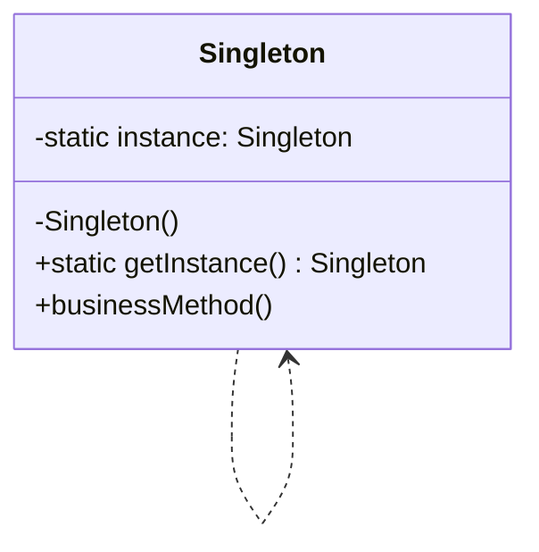

# Singleton Design Pattern

### The Singleton Pattern ensures that a class has only one instance and provides a global point of access to it. This is particularly useful when exactly one object is needed to coordinate actions across the system.

n this example, the Singleton class uses a thread-safe implementation with std::atomic and a std::mutex to ensure safe initialization in a multithreaded environment.

---

## Code Implementation

### Full Implementation in C++

```cpp
#include <iostream>
#include <atomic>
#include <mutex>

class Singleton {
private:
    static std::atomic<Singleton*> instance;
    static std::mutex mutex;

    Singleton() = default; // Private constructor

public:
    // Delete copy constructor and assignment operator
    Singleton(const Singleton&) = delete;
    Singleton& operator=(const Singleton&) = delete;

    static Singleton* getInstance() {
        Singleton* temp = instance.load(std::memory_order_acquire);
        if (!temp) {
            std::lock_guard<std::mutex> lock(mutex);
            temp = instance.load(std::memory_order_relaxed);
            if (!temp) {
                temp = new Singleton();
                instance.store(temp, std::memory_order_release);
            }
        }
        return temp;
    }

    void showMessage() {
        std::cout << "Singleton Instance!" << std::endl;
    }
};

// Define static members
std::atomic<Singleton*> Singleton::instance{nullptr};
std::mutex Singleton::mutex;

int main() {
    Singleton* singleton = Singleton::getInstance();
    singleton->showMessage();
    return 0;
}


```

---

## Explanation

### Key Components

1. **Static Instance (instance)**:
   - Ensures only one instance of the Singleton class exists.
   - Declared as std::atomic to allow safe access in a multithreaded environment.

2. **Mutex (mutex)**:
   - Protects the critical section during instance initialization.
     
3. **Private Constructor**:
   - Ensures that no other class can instantiate the Singleton directly.

4. **Deleted Copy Constructor and Assignment Operator**:
   - Prevents copying or assigning the Singleton instance.

5. **getInstance Method**:
   - Provides global access to the single instance.
   - Uses a double-checked locking mechanism for thread-safe lazy initialization.

---

## UML Diagram



---

## Advantages

1. **Controlled Access**:
   - Ensures a single instance of the class.

2. **Lazy Initialization**:
   - The instance is created only when it is first accessed, saving resources.
     
3. **Thread Safety**:
   - Uses std::atomic and std::mutex to ensure safe initialization in multithreaded scenarios.
     
## Disadvantages

1. **Global State**:
   - Can introduce hidden dependencies and make testing more difficult.

2. **Complexity**:
   - Thread-safe implementations (like this one) are more complex than naive implementations. 

3. **Resource Management**:
   - Requires careful handling of instance destruction in some cases.

---

## When to Use

- When only one instance of a class is needed (e.g., logging, caching, configuration management).
- When you need a single point of access to shared resources.
