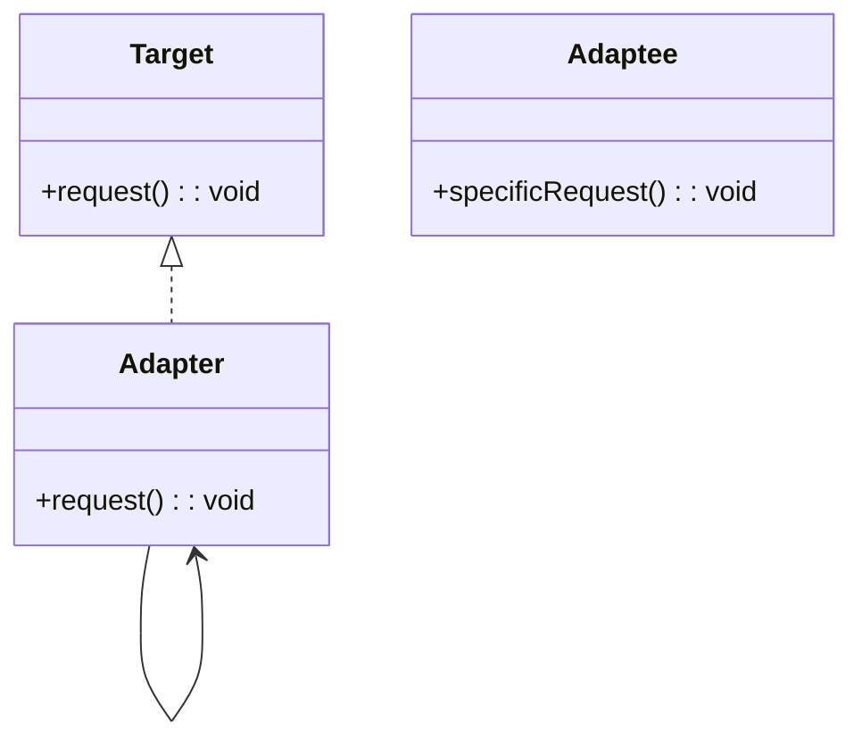

# Adapter Design Pattern

### The Adapter Pattern is a structural design pattern that allows incompatible interfaces to work together. It acts as a bridge between two interfaces, making the existing interface of a class compatible with another interface.

In this example, we demonstrate how to adapt an OldSystem to work with a NewSystem interface.

---

## Code Implementation

### Full Implementation in C++

```cpp
#include <iostream>
using namespace std;

class NewSystem {
public:
    virtual void newRequest() = 0; 
};

class OldSystem {
public:
    void oldRequest() {
        cout << "Old system request." << endl;
    }
};

class Adapter : public NewSystem {
private:
    OldSystem* oldSystem;

public:
    Adapter(OldSystem* oldSys) : oldSystem(oldSys) {}

    void newRequest() override {
        oldSystem->oldRequest(); 
    }
};

int main() {

    OldSystem* oldSystem = new OldSystem();

    NewSystem* newSystem = new Adapter(oldSystem);

    newSystem->newRequest();  

    delete oldSystem;
    delete newSystem;

}


```

---

## Explanation

### Key Components

1. **Target Interface (NewSystem)**:
   - Defines the interface that clients use..

2. **Adaptee (OldSystem)**:
   - An existing class with an interface that is incompatible with the target interface.
     
3. **Adapter**:
   - A class that implements the target interface (NewSystem) and translates the requests into calls to the adaptee (OldSystem).

4. **Client**:
   - The client code (main function) uses the target interface (NewSystem) without being aware of the adaptee (OldSystem).
---

## UML Diagram



---

## Advantages

1. **Reusability**:
   - Allows old code to work with new systems without modifying it.
     
2. **Flexibility**:
   - Flexibility

3. **Decoupling**:
   -  Decouples the client code from the implementation details of the adaptee.

## Disadvantages

1. **Increased Complexity**:
   - Adds an extra layer of indirection, which may complicate the system.
2. **Limited Scope**:
   - Works well for adapting one specific interface but can become unwieldy for broader use cases.

---

## When to Use

- When you need to use an existing class with an incompatible interface.
- To allow old and new systems to work together without modifying their code.
- To create a bridge between legacy and modern systems.
